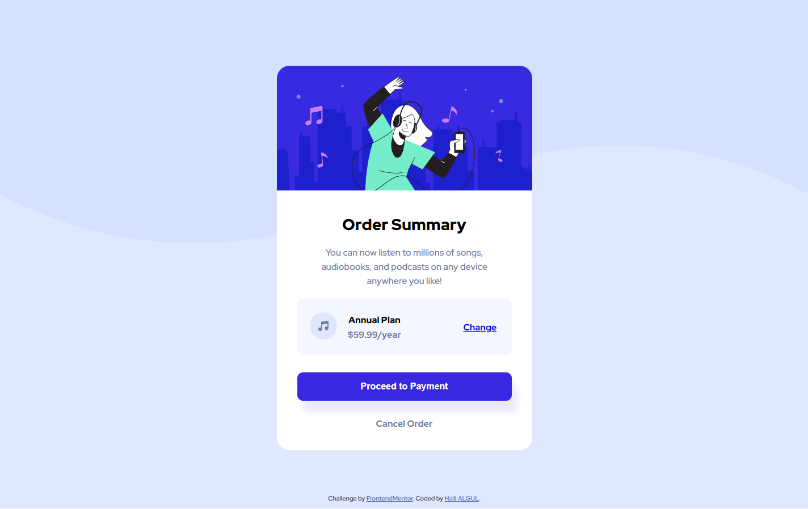

# Frontend Mentor - Order Summary Card Solution

This is a solution to the [Order Summary Card challenge on Frontend Mentor](https://www.frontendmentor.io/challenges/intro-component-with-signup-form-5cf91bd49edda32581d28fd1). Frontend Mentor challenges help you improve your coding skills by building realistic projects.

## Table of contents

- [Frontend Mentor - Order Summary Card Solution](#frontend-mentor---order-summary-card-solution)
  - [Table of contents](#table-of-contents)
  - [Overview](#overview)
    - [The challenge](#the-challenge)
    - [Screenshot](#screenshot)
    - [Links](#links)
    - [Built with](#built-with)
    - [Useful resources](#useful-resources)
  - [Author](#author)
  - [Acknowledgments](#acknowledgments)

## Overview

### The challenge

Users should be able to:

- See hover states for interactive elements

### Screenshot

- 

### Links

- Solution URL: [Frontend Mentor | My Solution](https://www.frontendmentor.io/solutions/intro-component-with-signup-form-css-boostrap-js-B19rUo1Sq)
- Live Site URL: [Halibal | Order Summary Card](https://halibal.github.io/intro-component-with-signup-form/)

### Built with

- Semantic HTML5 markup
- CSS custom properties
- [Flex](https://getbootstrap.com/docs/5.0/utilities/flex/)

### Useful resources

## Author

- LinkedIn - [Halil ALGUL](https://www.linkedin.com/in/halilagul/)
- Frontend Mentor - [@halibal](https://www.frontendmentor.io/profile/halibal)
- github - [halibal](https://github.com/halibal)

## Acknowledgments

I sincerely thank [Ayse Varlik](https://www.frontendmentor.io/profile/aysevarlik) for the tips helped me on the completion of this project.
